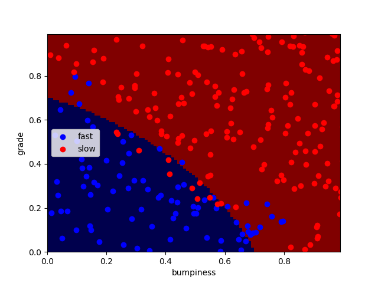

## Udacity Datascience course
This is my personal exploration of machine learning. Going through udacity course.

### 1 - Naive Bayesian Classifier

#### [a) GaussianNB Deployment on Terrain Data](./1_naiveby_terrain_data/01_GaussianNB_terrain)


Using sklearn to run a naive Bayesian Classifer
```
from sklearn.naive_bayes import GaussianNB
clf = GaussianNB()
clf.fit(features_train, labels_train)
```


#### [b) Calculating NB Accuracy](./1_naiveby_terrain_data/02_calculating_NBAccuracy)
